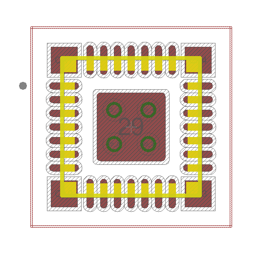
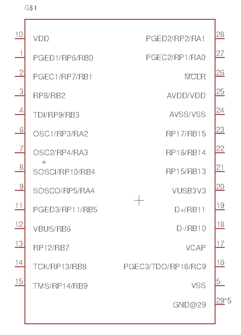

# PIC32MM0256GPM028 (UQFN-28) Eagle Library

This repository contains a custom Eagle CAD library for the **Microchip PIC32MM0256GPM028** microcontroller in the **UQFN-28** package.

## About the Library

This Eagle library includes:

- **Device**: PIC32MM0256GPM028 microcontroller
- **Package**: UQFN-28
- **Symbol**: Standard pinout symbol compatible with the device
- **Library Type**: Custom-designed for Autodesk Eagle-based PCB designs (EDA software). Tested in Eagle version 7.7.

## Images

### Package Layout  


### Symbol & Device View  


## About PIC32MM0256GPM028

The **PIC32MM0256GPM028** is part of Microchip's PIC32MM family of 32-bit microcontrollers, designed for:

- Ultra-low power consumption
- Compact size with 28-pin UQFN packaging
- 256KB Flash and 32KB RAM
- Rich peripheral set including ADC, UART, SPI, I²C, Timers, and more
- Ideal for space-constrained, cost-sensitive applications

## Project Use Case: Tactile Controller

This library was created as part of a larger project focused on building a tactile feedback module. The PIC32MM series was chosen for its low power usage, small footprint, and sufficient computing capabilities for real-time data sampling from a haptic sensor with an array of sensors.

## Repository Structure

```
eagle-library/
├── lib/PIC32MM0256GPM028_UQFN.lbr      # Eagle library file
├── img/
│   ├── package.png                     # UQFN-28 package image
│   └── device.png                      # Symbol/device image
└── README.md                           # Project documentation
```

## How to Use

1. Open Eagle CAD.
2. Add `pic32mm0256gpm028.lbr` to your library folder.
3. Load the library via the Eagle control panel.
4. Use the symbol and package in your schematic and board layout.

